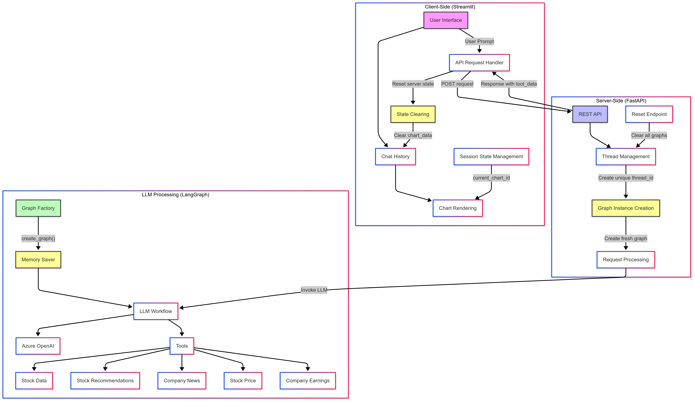
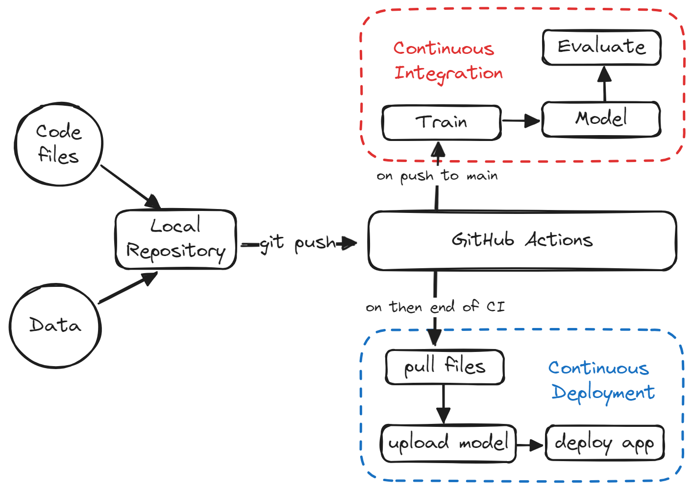

# 🔬 AI MiniLabs by Krishna

A curated collection of experimental AI mini-projects exploring the latest in large language models (LLMs), multimodal reasoning, reinforcement learning, and retrieval-augmented generation (RAG). These projects span real-world domains including finance, identity verification, voice interfaces, and document understanding.

> 💡 Inspired by the **Daily Dose of Data Science** newsletter—many of these explorations were sparked by their outstanding insights.

---

## 📁 Project Showcase

### 🔊Interactive-Knowledge-Agent
A Retrieval‑Augmented Generation (RAG) system enhanced by a deterministic multi-step agent architecture—essentially, a brain modeled as a graph that dynamically plans, retrieves, verifies, and synthesizes based on user question

**Architecture**  


### 🔊 Voicebot-RealTime-LLM
A real-time conversational voice assistant using LLMs to transcribe, interpret, and respond with speech.

**Architecture**  


---

### 🔈 AudioChat-Transcriber-RAG
Interact with audio files using a pipeline that transcribes and understands spoken content via RAG.

**Architecture**  


---

### 🌐 Website-RAG-Colivara
A multimodal RAG system that understands and answers queries from complex website structures—text + visuals.

**Architecture**  


---

### 🧩 Multimodal-RAG-Deepseek
Leverages DeepSeek Janus-Pro for vision-language reasoning over complex document layouts.

---

### 💬 Local-LLM-Chatbot
A lightweight ChatGPT-like experience using LLaMA 3.2 Vision—runs entirely offline on your local machine.

---

### 🧠 ModernBERT-RAG
A long-context document Q&A system using ModernBERT for efficient retrieval and classification.

**Architecture**  


---

### 🧪 SDV-MCP-SyntheticDataServer
Generate, analyze, and visualize synthetic tabular data using SDV—all offline via an MCP-based orchestration server.

**Architecture**  


---

### 📈 FinChat-GPT4o-StockRAG
Real-time stock analytics using GPT-4o and Azure AI. Features market trends, earnings summaries, and visual insights.

**Architecture**  


---

### ☁️ RAG-AWS-Chatbot
Built with AWS Bedrock—this RAG chatbot uses Knowledge Bases, Agents, IAM, and S3, with a clean Streamlit UI.

**Architecture**  


---

### ♻️ RL-Reasoning-LLMs
Experiments with reinforcement learning techniques (PPO, GRPO) to fine-tune reasoning capabilities of LLMs like DeepSeek and Qwen.

---

### 💰 FinanceML-Realworld-Forecasting
Two financial ML use cases using open datasets:
- Cash Liquidity Forecasting  
- Cash Flow Optimization with ML

---

### 🧑‍💻 Face-AntiSpoofing-Exploration
Applies deep learning to detect facial spoofing—vital for secure eKYC/identity verification flows.

---

### 🪪 eKYC-LLM-Exploration
Full eKYC pipeline combining OCR, computer vision, and LLM reasoning to extract identity data from document scans.

---


### 📄 SmartQuizBuilder_AI
AI-powered tool that generates quizzes from uploaded PDFs using Google Vertex AI and Streamlit.


### ⚙️ ML-CICD-Pipeline
CI/CD pipeline for machine learning with GitHub Actions—automated training, evaluation, and Hugging Face deployment.
**Architecture**  


## 🛠️ Installation

1. Clone the repository:

   ```bash
   git clone https://github.com/your-username/AI-MiniLabs-by-Krishna.git
   cd AI-MiniLabs-by-Krishna
   ```

2. Navigate into any project folder for instructions:

   ```bash
   cd Voicebot-RealTime-LLM
   ```

3. Follow the included `README.md` for environment setup and usage.

---

## 🚀 Highlights

- 💬 Voice + Vision + Text Interaction  
- 🔍 Retrieval-Augmented Generation (RAG)  
- 📉 Real-Time Financial Insights  
- 🛡️ eKYC and Anti-Spoofing Tech  
- 🧪 RL-based Reasoning for LLMs  
- 🧠 Fully Local Multimodal Chatbot  

---

## 🙌 Acknowledgements

Special thanks to the **[Daily Dose of Data Science](https://www.dailydoseofds.com//)** newsletter team for their exceptional content, which played a key role in inspiring and informing many of these projects.

---

## 👤 Author

**Krishna Kaushik**  
[GitHub](https://github.com/krishnakaushik25) • [LinkedIn](https://www.linkedin.com/in/kaushik-2523/)
